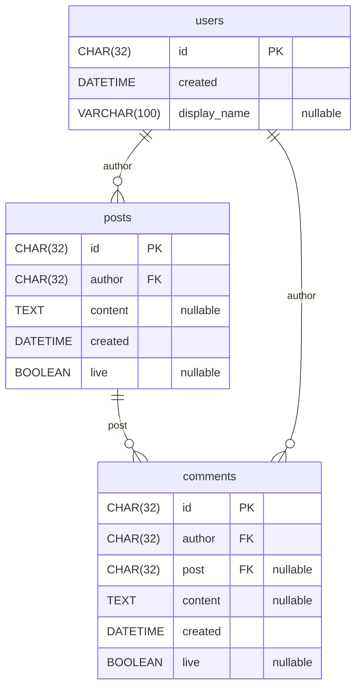
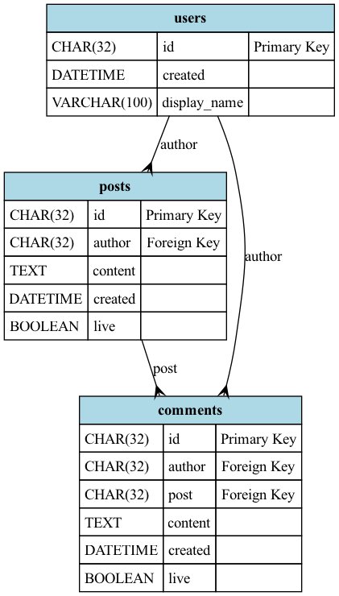

# Paracelsus

Paracelsus generates Entity Relationship Diagrams by reading your SQLAlchemy models.

- [Paracelsus](#paracelsus)
  - [Features](#features)
  - [Usage](#usage)
    - [Installation](#installation)
    - [Basic CLI Usage](#basic-cli-usage)
    - [Importing Models](#importing-models)
    - [Generate Mermaid Diagrams](#generate-mermaid-diagrams)
    - [Inject Mermaid Diagrams](#inject-mermaid-diagrams)
    - [Creating Images](#creating-images)
    - [pyproject.toml](#pyprojecttoml)
  - [Sponsorship](#sponsorship)

## Features

- ERDs can be injected into documentation as [Mermaid Diagrams](https://mermaid.js.org/).
- Paracelsus can be run in CICD to check that databases are up to date.
- ERDs can be created as files in either [Dot](https://graphviz.org/doc/info/lang.html) or Mermaid format.
- DOT files can be used to generate SVG or PNG files, or edited in [GraphViz](https://graphviz.org/) or other editors.

## Usage

### Installation

The paracelsus package should be installed in the same environment as your code, as it will be reading your SQLAlchemy base class to generate the diagrams.

```bash
pip install paracelsus
```

### Basic CLI Usage

Paracelsus is primarily a CLI application.


```bash
paracelsus --help
```

It has three commands:

- `version` outputs the version of the currently installed `paracelsus` cli.
- `graph` generates a graph and outputs it to `stdout`.
- `inject` inserts the graph into a markdown file.

### Importing Models

SQLAlchemy models have to be imported before they are put into the model registry inside of the base class. This is similar to how [Alembic](https://alembic.sqlalchemy.org/en/latest/) needs models to be imported in order to generate migrations.

The `--import-module` flag can be used to import any python module, which presumably will include one or more SQLAlchemy models inside of it.

```bash
paracelsus graph example_app.models.base:Base \
  --import-module "example_app.models.users" \
  --import-module "example_app.models.posts" \
  --import-module "example_app.models.comments"
```

The `:*` modify can be used to specify that a wild card import should be used. Make sure to wrap the module name in quotes when using this to prevent shell expansion.

```bash
paracelsus graph example_app.models.base:Base --import-module "example_app.models:*"
```

This is equivalent to running this style of python import:

```python
from example_app.models import *
```

### Include or Exclude tables

After importing the models, it is possible to select a subset of those models by using the `--exclude-tables` and `--include-tables` options.
These are mutually exclusive options, the user can only provide inclusions or exclusions:

```bash
paracelsus graph example_app.models.base:Base \
  --import-module "example_app.models.*" \
  --exclude-tables "comments"
```

This is equivalent to:

```bash
paracelsus graph example_app.models.base:Base \
  --import-module "example_app.models.*" \
  --include-tables "users"
  --include-tables "posts"
```

You can also use regular expressions in the `include-tables` and `exclude-tables` options.

```bash
paracelsus graph example_app.models.base:Base \
  --import-module "example_app.models.*" \
  --exclude-tables "^com.*"
```

### Specify Column Sort Order

By default Paracelsus will sort the columns in all models such as primary keys are first, foreign keys are next and all other
columns are sorted alphabetically by name.

```bash
paracelsus graph example_app.models.base:Base \
  --import-module "example_app.models.users" \
```

produces the same results as:

```bash
paracelsus graph example_app.models.base:Base \
  --import-module "example_app.models.users" \
  --column-sort key-based
```

Pass the --column-sort option to change this behavior. To preserve the order of fields present in the models use "preserve-order":

```bash
paracelsus graph example_app.models.base:Base \
  --import-module "example_app.models.users" \
  --column-sort preserve-order
```

### Omit Comments

By default, SQLAlchemy column comments are included in the generated mermaid diagrams. You can omit these comments using the `--omit-comments` flag, which [might improve](https://github.com/tedivm/paracelsus/issues/32) legibility.

### Generate Mermaid Diagrams


> paracelsus graph example_app.models.base:Base --import-module "example_app.models:*"

```text
erDiagram
 users {
  CHAR(32) id PK
  DATETIME created
  VARCHAR(100) display_name "nullable"
 }

 posts {
  CHAR(32) id PK
  CHAR(32) author FK
  TEXT content "nullable"
  DATETIME created
  BOOLEAN live "nullable"
 }

 comments {
  CHAR(32) id PK
  CHAR(32) author FK
  CHAR(32) post FK "nullable"
  TEXT content "nullable"
  DATETIME created
  BOOLEAN live "nullable"
 }

 users ||--o{ posts : author
 posts ||--o{ comments : post
 users ||--o{ comments : author
```

When run through a Mermaid viewer, such as the ones installed in the markdown viewers of many version control systems, this will turn into a graphic.



### Inject Mermaid Diagrams

Mermaid Diagrams and Markdown work extremely well together, and it's common to place diagrams inside of project documentation. Paracelsus can be used to inject diagrams directly into markdown configuration. It does so by looking for specific tags and placing a code block inside of them, replacing any existing content between the tags.


```markdown
## Schema
<!-- BEGIN_SQLALCHEMY_DOCS -->

<!-- END_SQLALCHEMY_DOCS -->
```

> paracelsus inject db/README.md example_app.models.base:Base --import-module "example_app.models:*"


The `--check` flag can be used to see if the command would make any changes. If the file is already up to date then it will return a status code of `0`, otherwise it will return `1` if changes are needed. This is useful in CI/CD or precommit hook to enforce that documentation is always current.

> paracelsus inject db/README.md example_app.models.base:Base --import-module "example_app.models:*" --check

### Creating Images

GraphViz has a command line tool named [dot](https://graphviz.org/doc/info/command.html) that can be used to turn `dot` graphs into images.

To create an SVG file:

> paracelsus graph example_app.models.base:Base --import-module "example_app.models:*" --format dot | dot -Tsvg > output.svg

To create a PNG file:

> paracelsus graph example_app.models.base:Base --import-module "example_app.models:*" --format dot | dot -Tpng > output.png




### pyproject.toml

The settings for your project can be saved directly in the `pyprojects.toml` file of your project.

```toml
[tool.paracelsus]
base = "example.base:Base"
imports = [
  "example.models"
]
```

This also allows users to set excludes, includes, and column sorting.

```toml
[tool.paracelsus]
base = "example.base:Base"
imports = [
  "example.models"
]
exclude_tables = [
  "comments"
]
column_sort = "preserve-order"
omit_comments = false
```

## Sponsorship

This project is developed by [Robert Hafner](https://blog.tedivm.com) If you find this project useful please consider sponsoring me using Github!

<center>

[](https://github.com/sponsors/tedivm)

</center>
